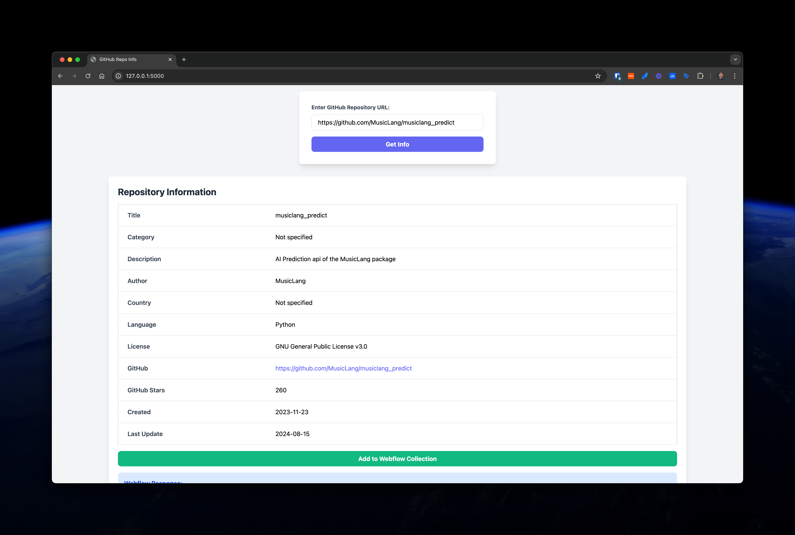

# GitHub to Webflow Integration

This project is a Flask-based web application that allows users to fetch GitHub repository information and manually add it to a Webflow collection. The application uses the GitHub API to retrieve repository data and the Webflow API to add this data to a Webflow CMS collection.




## Features

- **GitHub Integration**: Fetches details of a GitHub repository, including the title, description, author, language, and more.
- **OpenAI Integration (Optional)**: Enhances the description of the GitHub repository using OpenAI's GPT-3.5.
- **Webflow Integration**: Manually add fetched GitHub repository data to a Webflow CMS collection with a single click.

## Requirements

- Python 3.8 or higher
- Flask
- Requests
- dotenv (for managing environment variables)
- OpenAI Python Client (if using the OpenAI enhancement)

## Installation

1. **Clone the Repository**:
    ```bash
    git clone https://github.com/yourusername/brave-github.git
    cd brave-github
    ```

2. **Install Dependencies**:
    ```bash
    poetry install
    ```

3. **Configure Environment Variables**:
    - Create a `.env` file in the root of your project and add the following environment variables:

    ```env
    GITHUB_API_URL=https://api.github.com/repos/
    OPENAI_API_KEY=your_openai_api_key
    WEBFLOW_API_KEY=your_webflow_api_key
    WEBFLOW_COLLECTION_ID=your_webflow_collection_id
    USE_OPENAI_ENHANCED_DATA=true  # Set to 'false' if you don't want to use OpenAI for enhanced descriptions
    ```

4. **Run the Application**:
    ```bash
    flask run start 
    ```
    or
    ```bash
    poetry run python -m brave_github
    ```

6. **Access the Application**:
    - Open your web browser and navigate to `http://127.0.0.1:5000/`.

## Usage

1. **Fetch GitHub Repository Information**:
    - Enter the URL of a public GitHub repository in the input field and click "Get Info".
    - The application will fetch and display information about the repository.

2. **Add to Webflow Collection**:
    - After the repository information is displayed, you can manually add this data to your Webflow collection by clicking the "Add to Webflow Collection" button.
    - The application will send the data to Webflow using the Webflow API and display the response on the page.

## Project Structure

- `app.py`: Main application file containing the Flask app and route handlers.
- `templates/index.html`: HTML template for the main page.
- `static/`: Directory for static files like CSS and JavaScript (not used extensively in this project).
- `.env`: Environment variables file (not included in the repository, to be created manually).
- `README.md`: This file.


## Troubleshooting

- **Validation Errors**: Ensure that the data sent to Webflow matches the collection schema exactly. Field names and data types must align with those defined in your Webflow collection.
- **GitHub Rate Limits**: If you're fetching a lot of repositories, be aware of GitHub's API rate limits.

## Contributing

Contributions are welcome! Please fork this repository and submit a pull request if you would like to contribute.

## License

This project is licensed under the MIT License. 

## Acknowledgments

- [Flask](https://flask.palletsprojects.com/) - The web framework used for this project.
- [GitHub API](https://docs.github.com/en/rest) - Used to fetch repository data.
- [Webflow API](https://developers.webflow.com/) - Used to add items to Webflow collections.
- [OpenAI GPT-3.5](https://openai.com/gpt-3/) - Optionally used to enhance repository descriptions.